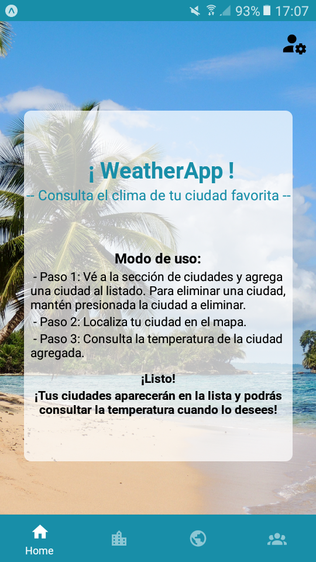
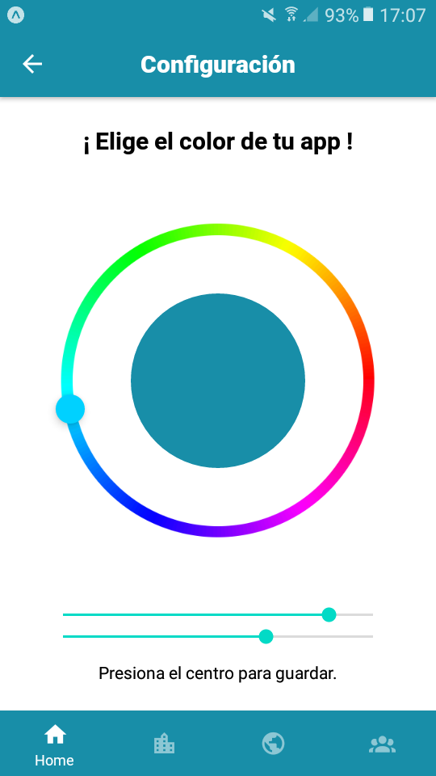
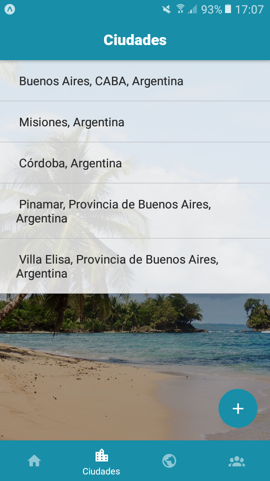
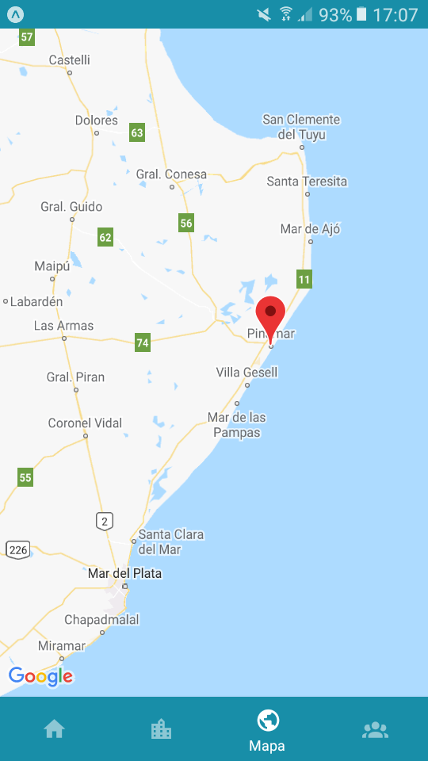

¡ WeatherApp !

Clona el repositorio y luego ejecuta el comando 'npm install' o 'yarn install' de acuerdo a
tu package manager preferido.

Integrantes (Grupo 97):

- Nicolas Martinez
- Ricardo Benitez
- Leonardo Sanchez

Persona Canvas
./persona_canvas_tp_heladeria.jpg

Pantalla de inicio:

Podrás elegir tu color preferido!

Tus ciudades favoritas se verán en un listado. Presionando sobre ellas podrás ver el clima.

También aparecerán en la sección del mapa!

